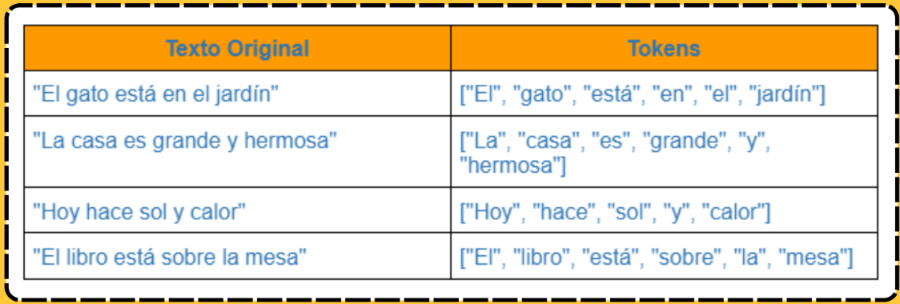
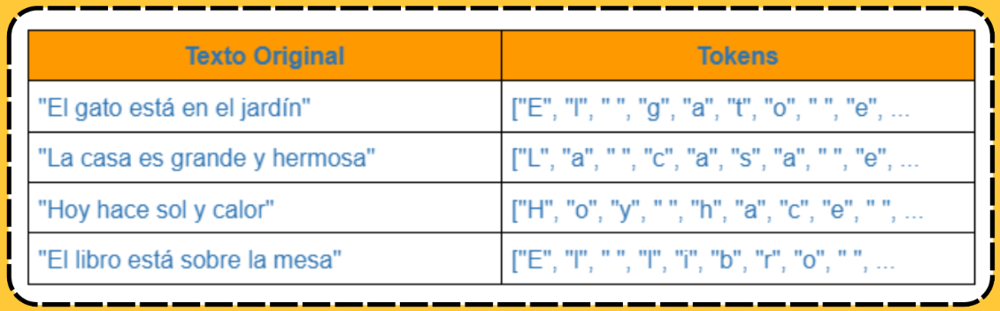
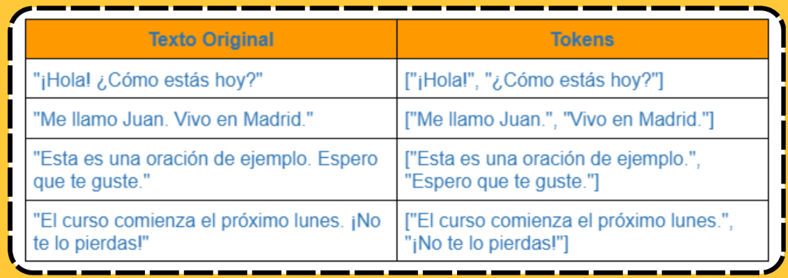

**Tokenización** 

**LECCIÓN 2** 

Lección 2: Tokenización

**Tokenización**

La tokenización es una técnica fundamental en el análisis de texto, donde se descompone un texto en unidades más pequeñas, conocidas como tokens. Estos tokens pueden ser palabras individuales, caracteres o incluso frases, dependiendo del contexto y los requisitos específicos del análisis. La tokenización sirve para preparar el texto para su procesamiento posterior, ya que proporciona una representación estructurada y manejable de los datos textuales. Al dividir el texto en tokens, se facilita la aplicación de técnicas de análisis de texto, como el conteo de frecuencia de palabras, la lematización y la extracción de características. Además, la tokenización es necesaria en el desarrollo de modelos de lenguaje y sistemas de NLP, ya que permite a los algoritmos trabajar con datos textuales de manera eficiente y precisa. 

Existen diferentes tipos de tokenización, que varían según la unidad en la que se divida el texto. Los tipos más comunes incluyen:   

**Tokenización por palabras:** 

**En este enfoque,** el texto se divide en palabras individuales. Cada palabra se considera un token separado. Por ejemplo, la frase "El gato está durmiendo" se dividiría en los tokens **"El","gato","está", y "durmiendo".** 

**Tokenización por caracteres:** 

**En este caso,** el texto se divide en caracteres individuales. Cada carácter se considera un token separado. Por ejemplo, la palabra "gato" se dividiría en los tokens **"g","a","t", y "o".**

 
**Tokenización por subpalabras:** 

**Este enfoque** divide el texto en unidades más pequeñas que palabras completas, como subpalabras o morfemas. Es útil para idiomas con estructuras complejas o para tratar con palabras compuestas. Por ejemplo, la palabra "inestable" podría dividirse en **"in","est", y "able".** 

**Tokenización por frases:** 

**En algunos casos,** puede ser útil dividir el texto en frases completas en lugar de en palabras individuales. 

 
La tokenización resulta esencial en el análisis de texto, brindando una serie de ventajas y cumpliendo diversos propósitos en el procesamiento del lenguaje natural: 

Para empezar, estructura los datos textuales en unidades manejables, como palabras o caracteres, facilitando así su análisis y manipulación posterior. Además, al dividir el texto en tokens, ayuda a normalizar su formato, lo que simplifica la comparación y el análisis de diferentes documentos o conjuntos de datos. Otra ventaja clave es su papel en el análisis de frecuencia de palabras. La tokenización permite calcular con facilidad la frecuencia de ocurrencia de términos en un texto, proporcionando información valiosa sobre la importancia y distribución de las palabras en un conjunto de datos. 

La tokenización prepara el terreno para análisis semánticos más profundos. Al desglosar el texto en unidades semánticas, como palabras o frases, facilita la detección de temas, la clasificación de sentimientos y la extracción de información relevante. La tokenización proporciona una representación estructurada de los datos textuales, ideal como entrada para modelos de aprendizaje automático.

# Resumen

Tokenización es el proceso de dividir un texto en unidades más pequeñas llamadas tokens. Estos tokens pueden ser palabras, frases, oraciones o caracteres, y sirven como la base para el análisis y procesamiento del texto en tareas de NLP.

Tokenización por palabras: Divide el texto en palabras individuales.

Ejemplo: "El gato duerme." → ["El", "gato", "duerme", "."]

Tokenización por oraciones: Separa el texto en oraciones completas.

Ejemplo: "El gato duerme. El perro juega." → ["El gato duerme.", "El perro juega."]

Tokenización por caracteres: Divide el texto en caracteres individuales.

Ejemplo: "Hola" → ["H", "o", "l", "a"]

Tokenización por subpalabras: Divide palabras en unidades más pequeñas, como prefijos o sufijos, útil en modelos de lenguaje que manejan palabras desconocidas.

Ejemplo: "aprender" → ["apren", "der"]